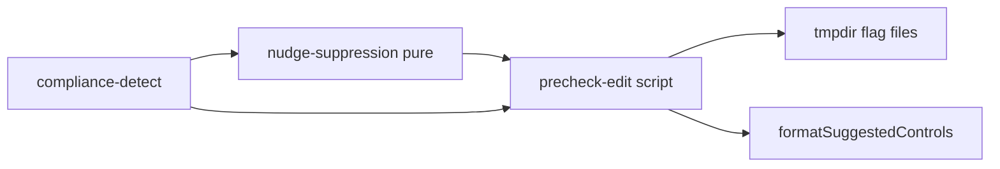
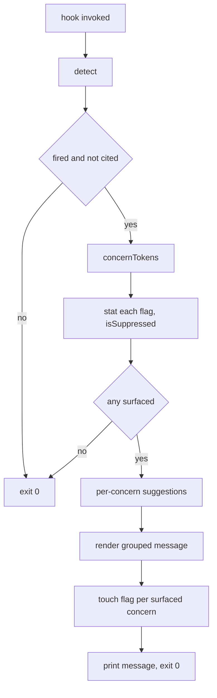

# Design Document

## Overview

**Purpose**: This feature improves the pre-edit hook's notification behavior so that the security-control nudge is per-concern, re-notifies on newly detected concerns, and expires after a bounded window — without changing detection or the blocking pre-commit gate.

**Users**: AI agents editing security-touching code through the Claude Code PreToolUse hook receive more accurate, less-swallowed control reminders.

**Impact**: Replaces the single path-domain-keyed, blended-suggestion, session-permanent suppression in `scripts/precheck-edit.ts` with per-concern keying, per-concern suggestions, and time-bounded suppression. Detection (`compliance-detect.ts`) and the pre-commit gate (`check-compliance-citations.ts`) are untouched.

### Goals
- Notify again when a later edit introduces a concern not previously surfaced this session (1.x).
- Attribute suggested controls to each detected concern (2.x).
- Expire suppression after a bounded, default-sane window (3.x).
- Preserve the non-blocking, low-noise, fail-open contract (4.x).

### Non-Goals
- Changing what counts as security-touching (paths/keywords in `compliance-detect.ts`).
- Changing the blocking behavior or output of the pre-commit citation gate.
- Persisting suppression state across machines or beyond the OS temp directory.

## Boundary Commitments

### This Spec Owns
- The notification/suppression logic of `scripts/precheck-edit.ts`: how a detected result is turned into concern identities, when a notification is emitted vs suppressed, and how suggestions are grouped in the message.
- A new pure module owning concern tokenization and the suppression/expiry decision.

### Out of Boundary
- Detection grammar and citation parsing (`compliance-detect.ts`) — consumed read-only.
- The pre-commit gate (`check-compliance-citations.ts`).
- The `controls_for_change` retrieval implementation (reused via `formatSuggestedControls`).

### Allowed Dependencies
- `compliance-detect.ts` — two distinct imports from the same module: `DetectionResult` (type-only) and `formatSuggestedControls` (runtime function reused as-is). The `Controls` node in the architecture diagram is a logical alias for this function, not a separate file.
- Node/Bun `fs` and `os` for flag-file state in `tmpdir()`.
- No new third-party dependencies.

### Revalidation Triggers
- A change to `DetectionResult`'s `matchedKeywords` / `domain` / `reason` shape.
- A change to `formatSuggestedControls`'s signature or return contract.
- A change to the flag-file location/naming consumed by any external cleanup tooling.

## Architecture

The script stays the only impure entrypoint; all decision logic moves into a pure, unit-testable module so behavior can be verified without stdin/exit/filesystem.

**Dependency direction** (leftward imports only):

`compliance-detect (types + reuse)` → `nudge-suppression (pure)` → `precheck-edit (script: fs + retrieval + IO)`



**Key decisions**:
- A **concern** is the unit of suppression and attribution, not the path domain. Concern tokens are derived from the detection result and used both as flag-file keys and as per-concern suggestion queries.
- Suppression state remains one flag file per identity in `tmpdir()`, but the identity is now `(sessionKey, concernToken)` and freshness is judged by file mtime against a TTL.
- `now` and flag mtimes are passed into pure functions as values, so the suppression decision is deterministic in tests.

### Technology Stack

| Layer | Choice / Version | Role in Feature | Notes |
|-------|------------------|-----------------|-------|
| Runtime | Bun | Executes the hook script and tests | Existing |
| Language | TypeScript (ESM, strict) | New pure module + script edits | Existing |
| Storage | OS temp dir (`os.tmpdir`) | Per-concern flag files | Existing mechanism, re-keyed |

## File Structure Plan

### New Files
```
src/
├── nudge-suppression.ts        # Pure: concern tokenization, flag naming, TTL/suppression decision
└── nudge-suppression.test.ts   # Unit tests (bun test) for the pure logic
```

### Modified Files
- `scripts/precheck-edit.ts` — replace single-domain flag keying with per-concern keying via `nudge-suppression`; loop suggestions per surfaced concern; render a grouped message; touch a flag per surfaced concern. Retain all early-exit/fail-open behavior.

> No change to `compliance-detect.ts` or `check-compliance-citations.ts`.

## Components and Interfaces

| Component | Layer | Intent | Req Coverage | Key Dependencies | Contracts |
|-----------|-------|--------|--------------|------------------|-----------|
| nudge-suppression | Pure logic | Concern identity + suppression/expiry decision | 1.1, 1.2, 1.3, 1.4, 3.1, 3.2, 3.3 | DetectionResult (type) | Service (functions) |
| precheck-edit | Script/IO | Orchestrate detect → suppress → suggest → notify | 1.1, 1.2, 1.3, 1.4, 2.1, 2.2, 2.3, 2.4, 3.1, 3.2, 3.3, 4.1, 4.2, 4.3, 4.4 | nudge-suppression (P0), compliance-detect (P0), fs/os (P1) | Service |

### Pure Logic

#### nudge-suppression

| Field | Detail |
|-------|--------|
| Intent | Turn a detection result into stable concern identities and decide, per concern, whether a notification is suppressed |
| Requirements | 1.1, 1.2, 1.3, 1.4, 3.1, 3.2, 3.3 |

**Responsibilities & Constraints**
- Derive an ordered, de-duplicated list of concern tokens from a detection result.
- Produce a filesystem-safe flag-file basename for a `(sessionKey, token)` pair.
- Decide whether a concern is currently suppressed given its flag mtime, the current time, and the TTL.
- Resolve the TTL from an optional env value with a sane default.
- Pure: no `fs`, no `Date.now`, no network — all inputs passed as arguments.

**Dependencies**
- Inbound: `precheck-edit` — calls these functions (P0).
- Outbound: none.
- External: `DetectionResult` type from `compliance-detect` (P0, type-only).

**Contracts**: Service [x]

##### Service Interface
```typescript
import type { DetectionResult } from "./compliance-detect.js";

/** Default suppression window: 30 minutes. */
export const DEFAULT_SUPPRESS_TTL_MS: number;

/**
 * Ordered, de-duplicated concern identities for a fired detection result.
 * Domain (when present) and each matched keyword become distinct tokens,
 * each prefixed by kind so a keyword and a same-named domain never collide.
 * Returns a single fallback token (never empty) when a path fired with no
 * domain and no keywords.
 */
export function concernTokens(
  result: Pick<DetectionResult, "matchedKeywords" | "domain" | "reason">
): string[];

/** Deterministic, filesystem-safe flag basename for a (session, concern). */
export function flagFileName(sessionKey: string, token: string): string;

/** True when a flag exists and its mtime is within the TTL window. */
export function isSuppressed(
  flagMtimeMs: number | null,
  nowMs: number,
  ttlMs: number
): boolean;

/** Parse COMPLIANCE_NUDGE_TTL_MS; fall back to default on missing/invalid. */
export function resolveTtlMs(envValue: string | undefined): number;
```
- Preconditions: `concernTokens` is called only for a fired result.
- Postconditions: `concernTokens` returns ≥1 token; `flagFileName` output matches `[A-Za-z0-9._-]+`.
- Invariants: same inputs → same outputs (referential transparency).

**Implementation Notes**
- Integration: token kinds use stable prefixes (`domain:`, `kw:`, `path`); the basename sanitizer maps any non-safe character to `_` and bounds length, optionally with a short hash suffix to avoid collisions after sanitization.
- Validation: covered by `nudge-suppression.test.ts`.
- Risks: keyword strings already constrained by the detection lists, so sanitization collisions are low-risk; the hash suffix removes the residual risk.

### Script / IO

#### precheck-edit (modified)

| Field | Detail |
|-------|--------|
| Intent | Read hook payload, run detection, decide per-concern notification, render grouped message, persist per-concern suppression |
| Requirements | 1.1–1.4, 2.1–2.4, 3.1–3.3, 4.1–4.4 |

**Responsibilities & Constraints**
- Preserve existing early exits: non-Edit/Write tool, empty path/content, `!result.fired`, `result.hasCitation` (4.2, 4.3).
- Compute concern tokens; for each, stat its flag file for mtime and ask `isSuppressed`.
- The **surfaced set** = tokens that are not suppressed (new or expired). If empty → exit 0 silently (1.3, 3.1).
- For each surfaced concern, call `formatSuggestedControls(token, …)` with small per-concern limits; build a grouped "Likely controls" block (2.1, 2.2). On empty/failed retrieval for a concern, emit the concern with a "run controls_for_change" fallback (2.3).
- Cap the number of surfaced concerns rendered to keep the message glanceable; note any overflow count (2.4).
- After composing, touch (create/update mtime) a flag file for each surfaced concern (1.2, 3.2).
- Always `process.exit(0)`; wrap retrieval and fs in try/catch and fail open (4.1, 4.4).

**Dependencies**
- Inbound: Claude Code PreToolUse hook (external).
- Outbound: `nudge-suppression` (P0); `compliance-detect` `detect`/`resolveConfig`/`loadProjectConfig`/`formatSuggestedControls` (P0); `node:fs`, `node:os` (P1).

**Contracts**: Service [x]

##### State Management
- State model: one zero-byte flag file per `(sessionKey, concernToken)` in `tmpdir()`; mtime is the timestamp.
- Persistence & consistency: best-effort; missing/unreadable flag ⇒ treated as not suppressed (re-notify), which is the safe default.
- Concurrency strategy: last-writer-wins on mtime; no locking needed (idempotent touch).

## System Flows



Gating notes: the `fired/cited` gate is unchanged from today; the new branch point is `isSuppressed` evaluated per concern rather than once per domain.

## Requirements Traceability

| Requirement | Summary | Components | Interfaces |
|-------------|---------|------------|------------|
| 1.1 | Notify when no prior notification for the concerns | precheck-edit, nudge-suppression | concernTokens, isSuppressed |
| 1.2 | Re-notify on a newly raised concern | precheck-edit, nudge-suppression | concernTokens, flagFileName |
| 1.3 | Suppress when all concerns already surfaced | precheck-edit, nudge-suppression | isSuppressed |
| 1.4 | Compare on concerns (keywords + domain), not domain alone | nudge-suppression | concernTokens |
| 2.1 | Suggestions for a single concern | precheck-edit | formatSuggestedControls |
| 2.2 | Suggestions grouped per concern for multi-concern edits | precheck-edit | formatSuggestedControls |
| 2.3 | Fallback to controls_for_change on retrieval failure | precheck-edit | — |
| 2.4 | Keep message glanceable (cap + overflow note) | precheck-edit | — |
| 3.1 | Suppress within window | nudge-suppression | isSuppressed |
| 3.2 | Re-notify when older than window | nudge-suppression | isSuppressed |
| 3.3 | Sane default window without config | nudge-suppression | resolveTtlMs, DEFAULT_SUPPRESS_TTL_MS |
| 4.1 | Always allow the edit | precheck-edit | — |
| 4.2 | No notify outside security set | precheck-edit (detect gate) | detect |
| 4.3 | No notify when already cited | precheck-edit (detect gate) | detect/hasCitation |
| 4.4 | Fail open on any error | precheck-edit | — |

## Error Handling

### Error Strategy
- All filesystem and retrieval operations are wrapped; any failure logs to stderr (as today) and the script exits 0 without notifying for the affected part (4.4).
- A missing or unreadable flag file is not an error: it means "not suppressed," so the concern is surfaced.

### Error Categories and Responses
- **Retrieval failure (per concern)**: render the concern with the `controls_for_change` fallback string (2.3).
- **Flag stat/write failure**: treat as not-suppressed for reads; ignore write failures (best-effort suppression).
- **Unexpected exception**: caught at top level → exit 0.

## Testing Strategy

### Unit Tests (`src/nudge-suppression.test.ts`)
- `concernTokens`: keyword-only, path+domain, path-only-no-domain (fallback token), de-duplication, ordering.
- `flagFileName`: filesystem-safe output for awkward tokens (e.g. `x509`, `private_key`); distinct domain vs keyword of same text.
- `isSuppressed`: within window → true; older than window → false; null mtime → false.
- `resolveTtlMs`: valid env, invalid env → default, unset → default.

### Integration (lightweight)
- Pure-logic composition covering the surfaced-set partition (new vs expired vs suppressed) for a representative multi-concern result. Script IO (stdin/exit) remains manually verifiable and is not unit-tested, consistent with the existing repo.

## Security Considerations
- Flag files are zero-byte and contain no secrets or file content; only sanitized concern tokens and the session key appear in names (the session key already derives from `session_id`/`cwd` hash as today). No new data is persisted.
